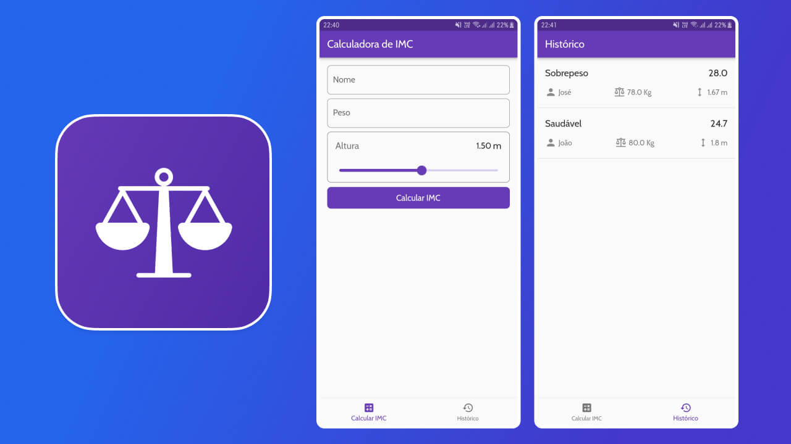

# Calculadora de IMC

Calculadora de IMC desenvolvida em Dart e Flutter para um projeto da trilha de
aprendizado de Flutter oferecida pelo Santander através da plataforma [DIO](https://www.dio.me/sign-in).




## Executando o projeto

Para executar o projeto você precisa ter o [Flutter](https://flutter.dev/)
instalado em sua máquina.

Esse passo a passo explica como executar o projeto via [VS Code](https://code.visualstudio.com/).

1. Abra a pasta do projeto no terminal

2. Execute o comando a seguir para instalar as dependências do projeto

   ```bash
   flutter pub get
   ```

3. Abra o projeto no VS Code e instale a [extensão Flutter](https://marketplace.visualstudio.com/items?itemName=Dart-Code.flutter)

4. Na área inferior direita do seu VS Code selecione o dispositivo em que você
   deseja executar a aplicação

5. Abra o arquivo `lib/main.dart` e aperte o botão play na área superior direita
